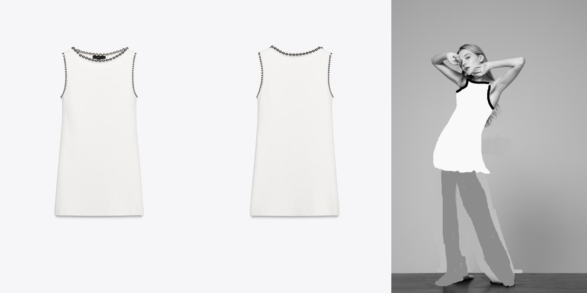
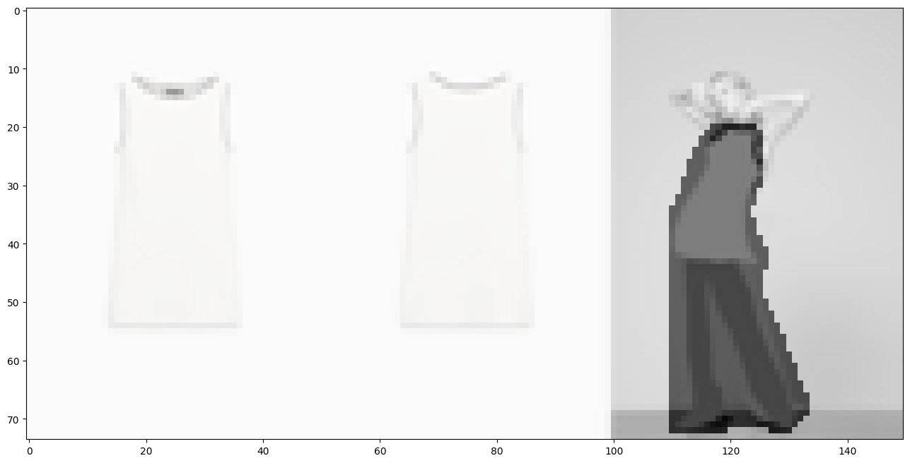
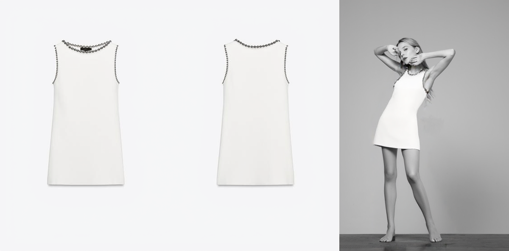
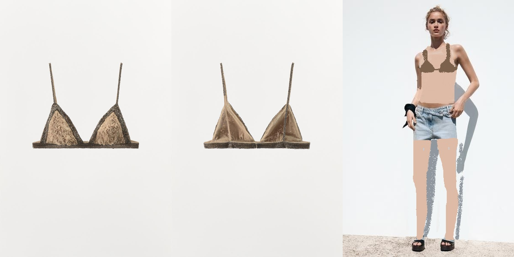
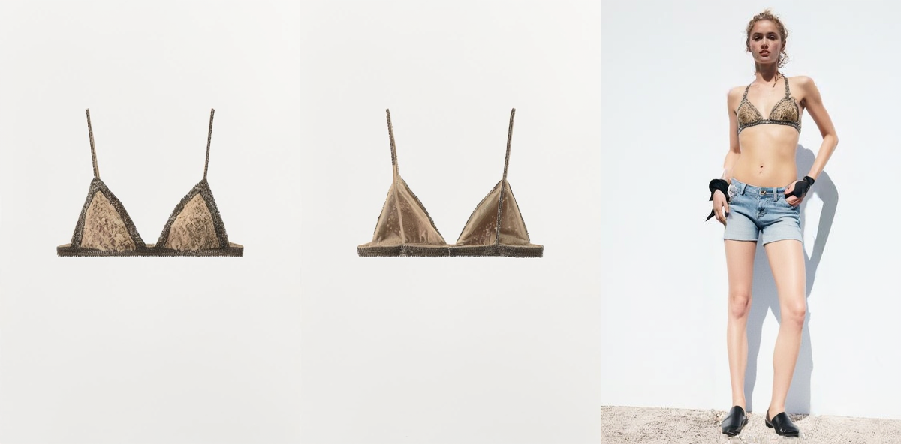
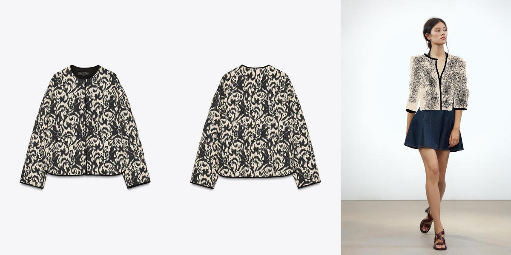
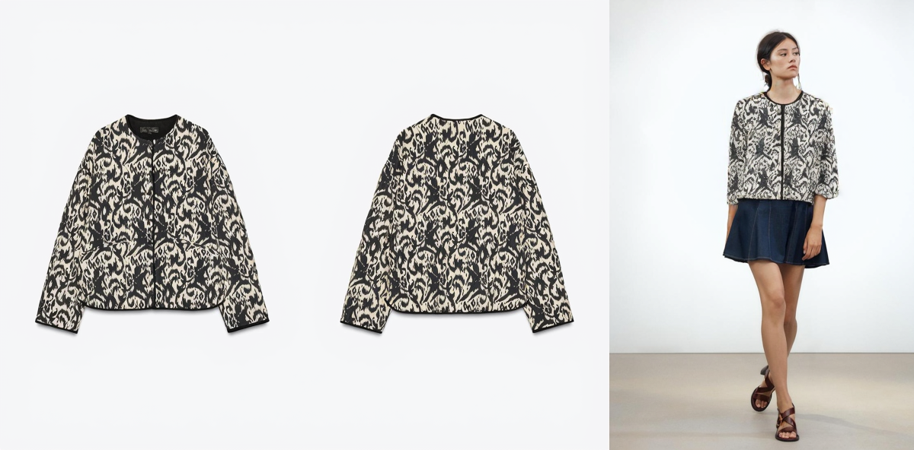

---

# In-Context LoRA for Diffusion Transformers (Unofficial)

This repository provides an **unofficial reproduction** of the paper [In-Context LoRA for Diffusion Transformers](https://arxiv.org/pdf/2410.23775), enabling in-context control and flexible garment try-on using diffusion models.
It covers the **complete pipeline**: data cleaning, caption generation, prompt construction, embedding extraction, model training, and inference.

**Key features:**

* **Virtual Try-On Generation**:

  * Generate model try-on images given *two product photos* (front and back/object views).
  * Conditioned Try-On via SDEdit: Given *two product photos* and a *reference model image*, use SDEdit to generate images of a specific model wearing the clothing.
* **Modular & reproducible workflow:** Each stage (data processing, prompt/caption, embedding, training, inference) can be run independently for flexible experiments.

## Dataset Preparation
0. **Configure data_clean_config.yaml**
   ```yaml
   training_data_human: Path to SVM training data for classifying between clothing and model (human) images.
   training_data_object: Path to SVM training data for classifying between clothing and model (object) images.
   all_data: Path to the directory containing all unclassified images.
   paired_data_path: Path to the directory containing data after classification.
   concat_data_path: Path to the directory where concatenated images are saved.
   max_concat_n:  Maximum number of concatenated images generated per item.
   do_check: Whether to validate that concatenated images follow the correct order (obj1, obj2, model).
   fail_path: Path to store images that do not meet the concatenation rules.
   vlm_model: Name of the vision-language model used for caption generation.


   ```
1. **Place your data** in a structured folder format, e.g.:

   ```
   data_root/
     item1/
     item2/
       ...
   ```

2. **Clean raw data:**

   ```bash
   python process_raw_data/clean_raw_imgs.py
   ```

3. **Concatenate images**

   ```bash
   python process_raw_data/concat_img.py
   ```

4. **Generate captions for images:**

   ```bash
   python process_raw_data/caption_generation.py
   ```


---

## Embedding Extraction

* For general embedding:

  ```bash
  python pre_embedding_data.py
  ```
* For the Flux pipeline:

  ```bash
  python pre_embedding_data_flux.py
  ```

---

## Training

Train the In-Context LoRA diffusion model with the following command:

```bash
python train_script_flux.py
```

---

## Inference

**Two modes are supported:**

1. **Try-On Generation from Two Product Images:** Generates a model wearing the given garment (from front/back/object shots).
  
2. **Conditioned Try-On via SDEdit:**
   Generates an image of a *specific* model (from a reference photo) wearing the target clothing, using SDEdit-based editing.
   
   0. Please run the inference script in an **interactive environment (such as IPython)**.

   1. Set the prompt and reference image, and perform simple editing on the model image before concatenating it with the reference image to enhance the generation results.
      ```python
      prompt = """Summary description <IMAGE 1> Object description 1 <IMAGE 2> Object description 2 <IMAGE 3> Model and object description
      """
      obj1, obj2,human = Image.open(...), Image.open(...), Image.open(...)
      img = Image.fromarray(
         np.concatenate([np.array(obj1), np.array(obj2), np.array(human)], axis=1)
      )
      ```

      

   2. Select the region that needs to be regenerated.
      ```python
      annotator = PolygonMaskAnnotator(img)
      annotator.show()
      ```
   3. Set the object region as the preserved area, and downsample the mask to the latent space
      ```python
      mask = annotator.get_mask()
      mask = mask < 127

      w, h = img.size
      vae_w = 2 * (w // (pipe.vae_scale_factor * 2))
      vae_h = 2 * (h // (pipe.vae_scale_factor * 2))
      mask = Image.fromarray(mask).resize([vae_w, vae_h])
      mask = np.array(mask)
      mask[:, :100] = 1
      plt.figure(figsize=(16, 16))
      plt.imshow(np.array(img.resize([vae_w, vae_h])))
      plt.imshow(mask, cmap="gray", alpha=0.5)
      ```
      
   
   
   4. run generation pipeline
   
---
## Checkpoint

https://huggingface.co/Johnny840420/flux_ic_lora_tryon_generation

---
## Example
1. prompt : This <Brand> bralette is a delicate, luxurious lingerie piece designed for elegance and comfort, featuring soft beige fabric with intricate floral embroidery and fine metallic trim along its edges, ideal for intimate wear or layering under light summer attire.\n\n<IMAGE 1> The front view of the <Brand> bralette displays triangle cups with semi-sheer floral embroidery on beige fabric, bordered by shimmering gunmetal metallic trim that outlines the shape and adds subtle glamour. Thin, adjustable straps rise from the cups, enhancing the minimalistic, lightweight silhouette. The texture is soft and slightly translucent, blending delicate craft with a sleek, refined edge.\n\n<IMAGE 2> From the back, the <Brand> bralette reveals the smooth, solid beige inner fabric of the cups and the adjustable hook clasp closure at the center. The metallic trim continues around the band, maintaining the piece’s cohesive shimmer. The thin straps maintain simplicity, emphasizing clean lines and functionality alongside the decorative front.\n\n<IMAGE 3> The model, a slender young woman with olive skin and curly brunette hair styled loosely in a messy bun, is captured from behind wearing the <Brand> bralette paired with a skinny short jeans. The skinny short jeans fit her hips and thighs perfectly. She accessorizes with black leather gloves and black ankle boots, blending casual ease with an edgy vibe. The scene is lit by dim daylight against a pristine white wall, emphasizing a clean, minimalist, and modern mood.

   Condition:
    
   
    
   Generation:
    
   


2. prompt:This <Brand> dress is a sleek, sleeveless mini dress in crisp white, crafted from a smooth, structured fabric that holds a clean, straight silhouette, perfect for sophisticated summer wear or chic evening occasions.The minimalist design is elevated by unique decorative bead detailing along the neckline and armholes, giving it a refined yet modern aesthetic.<IMAGE 1> The front view of the <Brand> dress showcases its simple, elegant lines with a high neckline and sleeveless cut. The smooth white fabric has a subtle sheen, enhancing the clean, minimalistic style. Distinctive black bead embellishments trace the neckline and armholes, adding texture and visual interest while maintaining the dress’s streamlined shape. The garment is cut straight, falling above the knee to create a timeless, versatile mini silhouette.\n\n<IMAGE 2> From the back, the <Brand> dress reveals a continuation of the sleek design, with the same bead detailing edging the neckline and armholes, emphasizing the craftsmanship. The back is plain and unembellished, allowing the unique trim to stand out. The fabric remains structured but flexible, gently skimming the form while maintaining the dress’s polished, minimal finish. This view highlights the garment’s simplicity and understated elegance.\n\n<IMAGE 3> The model is curvy female with fair skin and short, loosely styled blonde hair. She wears the <Brand> dress — a crisp white sleeveless mini-dress. The model poses barefoot on a wooden floor with one leg extended, arms raised and framing her face in a dynamic fashion-forward stance. The photo is rendered in grayscale.

   Condition:
    
   
    
   Generation:
    
   

3. prompt:This <Brand> jacket is a statement piece with a bold, monochrome animal-inspired jacquard pattern, crafted from textured woven fabric in cream and black. Its boxy silhouette, round collarless neckline, and cropped length create a modern, artistic edge, making it ideal for adding a unique accent to casual or creative ensembles.<IMAGE 1> The front view of the <Brand> jacket highlights its striking cream and black jacquard fabric, adorned with an all-over abstract animal pattern. The jacket features a rounded neckline, a concealed front placket, and practical side pockets seamlessly integrated into the design. The texture is visibly plush and structured, with black piping outlining the collar, front, and cuffs, providing a sharp finish that frames the bold motif.<IMAGE 2> From the back, the <Brand> jacket continues the uninterrupted jacquard pattern across a clean, slightly cropped boxy silhouette. The absence of seams or darts preserves the fluidity of the print, while the structured fabric ensures the jacket retains its shape. The black edging at the neckline and hem echoes the details seen from the front, maintaining a cohesive and polished look.<IMAGE 3> The model, a slender young woman with long dark hair styled simply, is shown wearing the <Brand> jacket over a navy mini dress. The jacket’s unique pattern and cropped shape stand out against the solid dress, while the sleeves are worn down, highlighting the piece’s relaxed yet sophisticated fit. The neckline of the jacket is worn slightly open, subtly revealing a portion of skin at the chest and adding an effortless, feminine touch to the look. She completes the outfit with brown leather sandals, set against a minimalist pale background under soft, natural lighting, creating a fresh and contemporary aesthetic that accentuates the jacket’s creative appeal.
    
   Condition:
    
   
    
   Generation:
    
   
    

---

## References

* [In-Context LoRA for Diffusion Transformers](https://arxiv.org/pdf/2410.23775)
* [Diffusers Library (HuggingFace)](https://github.com/huggingface/diffusers)
* [SDEdit: Guided Image Synthesis and Editing with Stochastic Differential Equations](https://arxiv.org/abs/2108.01073)

---

